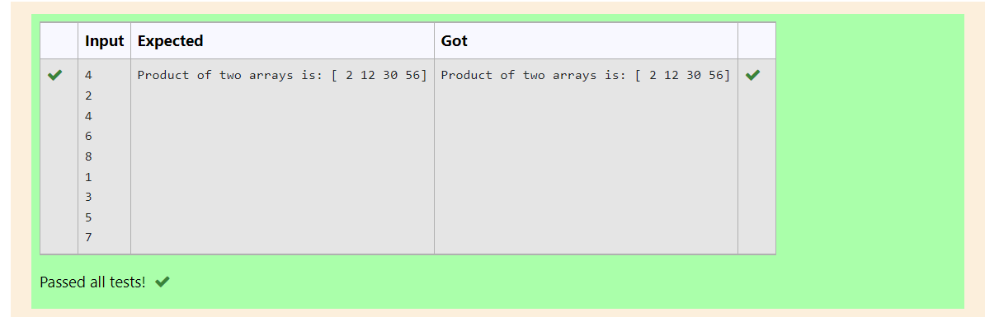

# Multiplying-two-matrix

## AIM:

## ALGORITHM:

### Step 1:
### Step 2:
### Step 3:
### Step 4:
### Step 5:

## PROGRAM:
```
import numpy as np
l1,l2=[],[]
n=int(input())
for i in range(n):
    l1.append(int(input()))
for j in range(n):
    l2.append(int(input()))
array1=np.array(l1)
array2=np.array(l2)
product=array1*array2
print("Product of two arrays is:",product)
```

## OUTPUT:


## RESULT:

